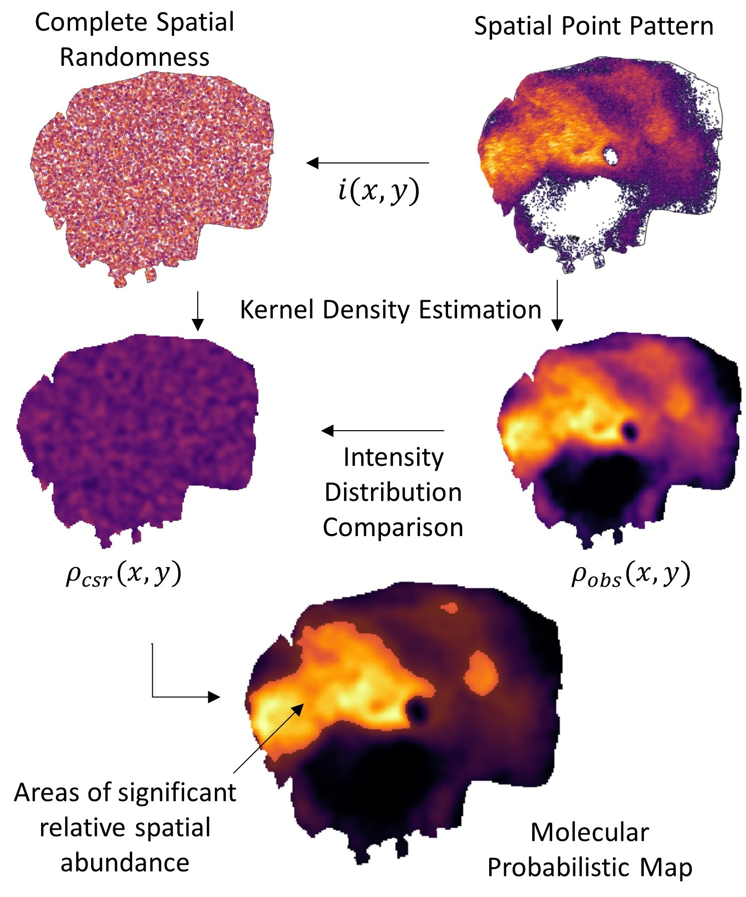

# **moleculaR**

### Spatial Probabilistic Mapping of Metabolite Ensembles in Mass Spectrometry Imaging

<br />
<br />

The `moleculaR` R package provides a computational framework that introduces probabilistic mapping
and point-for-point statistical testing of metabolites in tissue via Mass spectrometry imaging.
It enables collective `moleculaR` projections and consequently spatially-resolved investigation
of ion milieus, lipid pathways or user-defined biomolecular ensembles within the same image.

`moleculaR` comes pre-loaded with the [SwissLipids database](https://www.swisslipids.org) and with is capable of importing metabolite annotation results from the [METASPACE platform](https://metaspace2020.eu/) to compute FDR-verified `moleculaR` probability maps (MPMs) and collective projection probability maps (CPPMs). `moleculaR` could also be deployed and hosted on a centralized server and is equipped with a web-based GUI based on [Shiny](https://www.rdocumentation.org/packages/Shiny/versions/1.7.1). 

For more information about this package and its applications please refer to the associated paper (doi). 

<p align="right"></p>

### Installation

The [devtools](https://cran.r-project.org/web/packages/devtools/index.html) package could be used to install the development version of `moleculaR`:

```r
install.packages("devtools")

library("devtools")
install_github("CeMOS-Mannheim/moleculaR")
```
Note that `moleculaR` was created with `renv`to help manage R package dependencies and computational reproducibility. for more info, check [the renv guide page](https://rstudio.github.io/renv/articles/renv.html). 

### Data availability

Example MSI data could be downloaded in [imzML](https://ms-imaging.org/imzml/) fomat via [this link](https://metaspace2020.eu/project/abusammour-2021) (not yet public). 

### Vignettes

Vignettes are provided with the package to illustrate basic functionality. You can see all installed vignettes by calling `browseVignettes("moleculaR")`. To read a speficic vignette use, for example, `vignette("exampleData-workflow")` and to view its code use `edit(vignette("exampleData-workflow"))`. 

### moleculaR Shiny-Apps

`moleculaR` provides two R Shiny web apps with intuitive web-based GUIs; a `web-app` which comes pre-loaded with an examplary reduced MALDI MSI dataset (see citation below) and a `package-app` which lets the user upload her own centroided [imzML](https://ms-imaging.org/imzml/) data and apply spatial probability mapping through Molecular Probability Maps (MPMs) and Collective Projection Probability Maps (CPPMs). 

### Deplyoing on a Local Server

`moleculaR` comes pre-loaded with two R Shiny-apps which could also be hosted on a local server by downloading and installing [Shiny Server](https://www.rstudio.com/products/Shiny/Shiny-server/) with which a user could run these apps from a local (or possibly remote) network from their browser. For more info please refer to the [Shiny Server download page](https://www.rstudio.com/products/Shiny/download-server/) and [installation instruction and server management](https://docs.rstudio.com/Shiny-server/#installation). 


### Citing moleculaR

<br />

### Contact

You are welcome to:

* submit suggestions and bug-reports at: <https://github.com/CeMOS-Mannheim/moleculaR/issues>
* send a pull request on: <https://github.com/CeMOS-Mannheim/moleculaR/>
* compose an e-mail to: <d.abu-sammour@hs-mannheim.de>

### License

See [license document](LICENSE.md).


