<style>
body {
text-align: justify}
h1.title {
  font-size: 32px;
}
h1 { /* Header 1 */
  font-size: 24px;
}
h2 { /* Header 2 */
    font-size: 20px;
}
h3 { /* Header 3 */
  font-size: 16px;
}
</style> 


# Introduction

The _moleculaR_ R package provides a computational framework that introduces probabilistic mapping and point-for-point statistical testing of metabolites in tissue via Mass spectrometry imaging. It enables collective projections of metabolites and consequently spatially-resolved investigation of ion milieus, lipid pathways or user-defined biomolecular ensembles within the same image.

_moleculaR_ comes pre-loaded with the SwissLipids database and with is capable of importing metabolite annotation results from the METASPACE platform to compute FDR-verified moleculaR probability maps (MPMs) and collective projection probability maps (CPPMs). 

For more information about this package and its applications please refer to the associated [preprint](https://doi.org/10.1101/2021.10.27.466114).

# Installation & Loading Example Data

_moleculaR_ can be installed via `devtools`, note that you to set `build_vignettes=TRUE` to build this vignette during package installation. Once installed, _moleculaR_ could be loaded with `library()`:


```r
# not run
install.packages("devtools")
devtools::install_github("CeMOS-Mannheim/moleculaR", build_vignettes=TRUE)

library(moleculaR)

```

# Importing & Processing MSI Data

Under the hood _moleculaR_ is mainly based on `MALDIquant`, `spatstat` and `Matrix` packages and provides some additional tools to help ipmport and process any given MSI dataset. Please note that currently only *centroided* MSI data is supported. _moleculaR_ expects two mandatory data inputs; a (processed) _imzML_ file and an additional _tsv_ file which contains a full continuous spectrum (with m/z and intensity columns) which either represents a random pixel within the imaging dataset or an average spectrum. 


```r
#-- not run --#

# read MSI data  
imzmlFile         <- "pathToFile.imzML" 
msData            <- readCentrData(path = imzmlFile) 

# single spectrum  
spectrFile        <- "pathToFile.tsv"                  
msSpectr          <- readSingleSpect(spectrFile) 

```

_moleculaR_ also accepts one optional input which is the annotations results for the given dataset which the user could retrieve from METASPACE (https://metaspace2020.eu) provided, of course, that the same dataset has been previously uploaded there for annotation. When this input is provided, _moleculaR_ takes these into consideration to filter out detections which were not verified by METASPACE at a certain FDR specified by the user. 


```r
#-- not run --#

# load the metaspace annotations file
pathToMtspc       <- "pathToFile.csv"                 
mtspc             <- read.csv(file = pathToMtspc, skip = 2, header = TRUE, colClasses = "character")

```

Finally, the SwissLipid database, which is provided with _moleculaR_ ,must be loaded: 


```r
#-- not run --#

# load the processed swisslipids db 
pathTosldb        <- system.file("extdata", "swisslipids-speciesOnly-sep2020.tsv", package = "moleculaR", mustWork = TRUE)
sldb              <- loadSwissDB(pathTosldb)

```

For subsequent analysis, an S3 `fwhm` object must be created which will hold information about full width at half maximum (FWHM) as a function of m/z axis and will be used to estimate FWHM at any given m/z value (for more info see `?estimateFwhm`):  


```r
#-- not run --#

# estimate fwhm from msSpectr
fwhmObj           <- estimateFwhm(s = msSpectr) 
                                                            
```

Before applying any preprocessing methods, it is highly recommended to perform peak-binning and peak filtering on `msData`, subsequently the user may apply any preprocessing methods provided by `MALDIquant` (keeping in mind that this is a centroided dataset). 


```r
#-- not run --#

# bin peaks
msData            <-  MALDIquant::binPeaks(msData, 
                                           tolerance = getFwhm(fwhmObj, 400)/400, #focusing on lipids 
                                           method = "relaxed")


# filter out peaks which occur in less than 1% of the time 
# Note: use 'moleculaR::' namespace to distinguish it from MALDIquant::filterPeaks if MALDIquant is loaded.
msData            <- moleculaR::filterPeaks(x = msData, minFreq = 0.01)

```


# Walkthrough - Example Data 

_moleculaR_ also comes pre-loaded with an example MALDI MSI dataset which is showcased in the associated preprint mentioned above. To load the example data (assuming that the package has been already loaded):


```r
library(moleculaR)

data("processed-example-Data")

# to see the loaded objects
ls()
#> [1] "fwhmObj" "msData"  "mtspc"   "sldb"
```
`msData` represents a centroided MALDI MSI dataset stored as a list of `MassPeaks` objects (see `?MALDIquant::MassPeaks` for more details), `fwhmObj` is an S3 object of type `fwhm` storing the calculated full width at half maximum (FWHM) information of `msData` (see `?moleculaR::fwhm` for more details), `mtspc` is a data frame storing the associated annotations file (≤0.2 FDR) which is downloaded directly from METASPACE (https://metaspace2020.eu) and `sldb` is a data frame storing the SwissLipids database filtered to only include the identifications outlined in `mtspc`.

To investigate FWHM as a function of m/z axis one could simply plot `fwhmObj`:


```r
plot(fwhmObj)
```

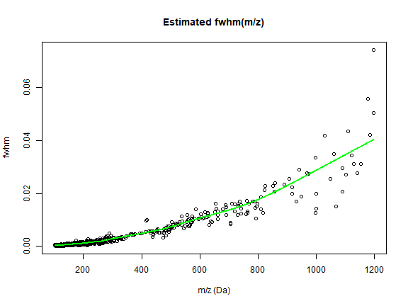

Or, to find the estimated FWHM at any given of m/z value one could simply pass `fwhmObj` to `GetFwhm` method:


```r
# FWHM at m/z 400
getFwhm(fwhmObj, 400)
#> [1] 0.005037548
```
To speed up downstream analysis, _moleculaR_ relies on a sparse matrix representation of the MSI data. To this end, `msData` has to be first converted to an S3 object of type `moleculaR::sparseIntensityMatrix`:


```r
#// create sparse matrix representation
spData <- createSparseMat(x = msData)
```


# Molecular Probability Maps (MPMs)

_moleculaR_ introduces the idea of molecular probability maps (MPMs) the main goal of which is to reduce the reliance on user's subjective opinion on the extent of spatial distribution of analytes within a given tissue section. Instead MPMs provide a user-unbiased statistical testing on the likelihood that a certain spatial intensity distribution has a significant abundance (i.e. analyte hotspot) or deficiency (i.e. analyte coldspot) within the tissue space. To illustrate this, consider as an example a peak-of-interest (POI) of 788.5447 m/z. 


```r
# input by m/z value
queryMass         <- 788.5447 
```

_moleculaR_ provides `searchAnalyte` method to retrieve inensity values at a specific m/z with a mass-window dictated by the estimated FWHM at that same m/z value (see `?moleculaR::searchAnalyte` for more info). Moreover, `searchAnalyte` gives the user the possibility to choose which weighting method to choose, for example, setting the argument `wMethod="sum"`  will generate the so called "ion image" as all peaks appearing within the estimated mass-window will be summed up: 


```r
# compute the regular ion image - returns an AnalytePiontPattern
sppIonImage      <- searchAnalyte(m = queryMass, 
                                  fwhm = getFwhm(fwhmObj, queryMass), 
                                  spData = spData, 
                                  wMethod = "sum")


# compute a raster image of the sppIonImage 
ionImage        <- spatstat.geom::pixellate(sppIonImage,
                          weights = sppIonImage$marks$intensity,
                          W = spatstat.geom::as.mask(sppIonImage$window,
                                                dimyx=c(diff(sppIonImage$window$yrange),
                                                        diff(sppIonImage$window$xrange))),
                          padzero = FALSE)

```

Now to compute a FWHM-dependent Gaussian weighted analyte point pattern representation, set `wMethod="Gaussian"`:


```r
# compute spatial point pattern of the analyte
sppMoi          <- searchAnalyte(m = queryMass, 
                            fwhm = getFwhm(fwhmObj, queryMass), 
                            spData = spData,
                            wMethod = "Gaussian")


plotAnalyte(sppMoi, analyte = paste0("m/z ", round(queryMass, 4)))
```

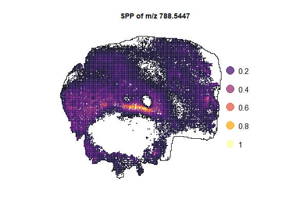


The `probMap` could then be called with the default parameters to calculate the corresponding MPM of the above POI (see `?probMap` for details) and the generic `plot` could be used on the result to plot a coposite detailed illustration (see `?plot.molProbMap` for details): 


```r
#// compute MPM - default parameters
probImg         <- probMap(sppMoi)

txt  <- paste0("m/z ", round(queryMass, 4), " ± ", round(getFwhm(fwhmObj, queryMass), 4))

#// plot everything together
par(cex.lab = 2, cex.main = 2, cex.axis = 1.5)
plot(probImg, what = "detailed", analyte = txt, ionImage = ionImage)
```

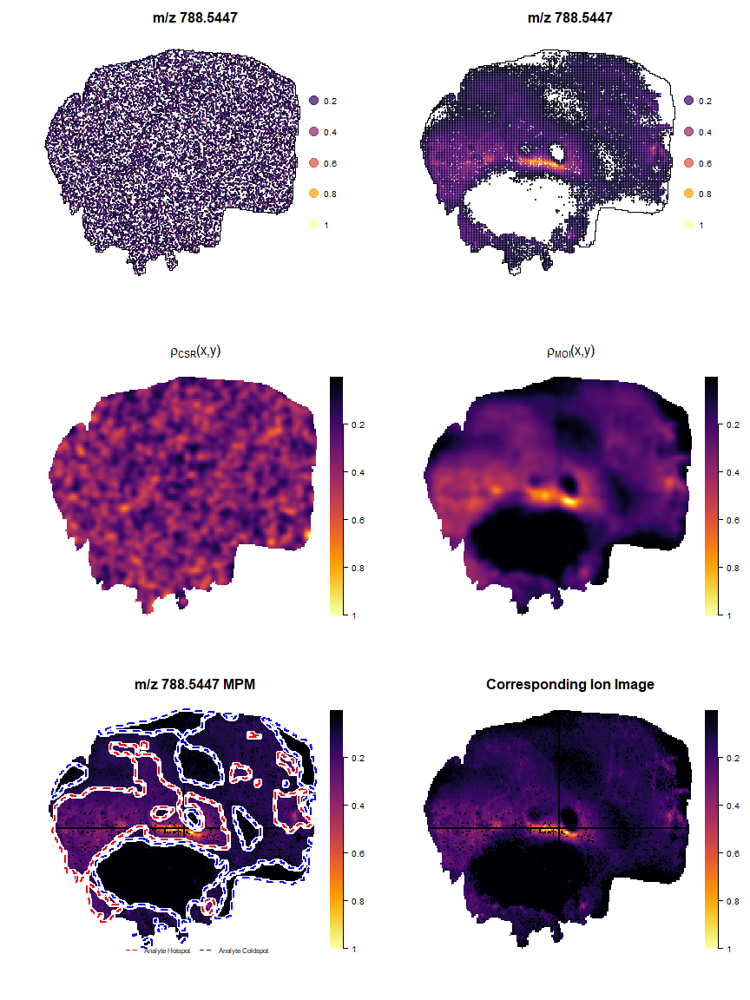

# Collective Projections Probability Maps (CPPMs)

Another concept introduced by _moleculaR_ is the collective projections probability maps (CPPMs) which, as the name implies, provides a framework for visualization of a set of analytes collectively in a single image space. This could be of interest when, for example, a user is interested in visualization a set of analaytes with a certain similarity (structure, functionality, etc.). For more information on how this is achieved, please refer to the associated preprint. 

## CPPMs - Lipid Classes

As _moleculaR_ is lipidome-focused in its current implementation, the test MSI dataset is screened against the internal instance of the SwissLipids database and is optionally verified by an externally provided lipidome annotation file downloaded from METASPACE for the given MSI dataset (pre-loaded for the current example). The `batchLipidSearch` method then is used to do this screening (for more details see `?batchLipidSearch`): 


```r
cat("Batch lipid search is ongoing - this will take several minutes - \n")

lipidHits <- batchLipidSearch(spData = spData, fwhmObj = fwhmObj, sldb = sldb,
                               adduct = c("M+H", "M+Na", "M+K"),
                               numCores = 4, 
                               verifiedMasses = as.numeric(mtspc$mz),
                               confirmedOnly = TRUE, verbose = TRUE)
#> Warning in batchLipidSearch(spData = spData, fwhmObj = fwhmObj, sldb = sldb, : Only single-core operation is supported on windows.

lipidHits
```

The results is an S3 object of type `spatstat::ppp` and `moleculaR::analytePointPattern` which contains all lipid identifications (against SwissLipids database) according to the provided `mtspc` annotation file. The metaData of the detected analytes are found in the `metaData` slot:


```r
# show metaData 
head(lipidHits$metaData)
#>             idx   mzVals mzConfirmed     mode adduct       lipidID sumformula    abbrev numDoubleBonds lipidClass
#> M+H  1639913693 327.1567        TRUE positive    M+H SLM:000055220  C13H25O7P LPA(10:0)              0   LPA(x:x)
#> M+H1 1640125163 299.1254        TRUE positive    M+H SLM:000055283  C11H21O7P  LPA(8:0)              0   LPA(x:x)
#> M+H2 1639663363 496.3398        TRUE positive    M+H SLM:000055318 C24H50NO7P LPC(16:0)              0   LPC(x:x)
#> M+Na 1640129893 518.3217        TRUE positive   M+Na SLM:000055318 C24H50NO7P LPC(16:0)              0   LPC(x:x)
#> M+H3 1639910137 494.3241        TRUE positive    M+H SLM:000055319 C24H48NO7P LPC(16:1)              1   LPC(x:x)
#> M+H4 1640146108 524.3711        TRUE positive    M+H SLM:000055322 C26H54NO7P LPC(18:0)              0   LPC(x:x)
```


To list all lipid classes which were detected (and confirmed by METASPACE; if `confirmedOnly=TRUE`):


```r
# whow all detected lipid classes
unique(lipidHits$metaData$lipidClass)
#>  [1] "LPA(x:x)"        "LPC(x:x)"        "LPC(O-x:x)"      "LPE(x:x)"        "LPS(x:x)"        "PA(x:x)"         "PA(O-x:x)"       "PC(x:x)"        
#>  [9] "PC(O-x:x)"       "PE(x:x)"         "PE(O-x:x)"       "PG(x:x)"         "PS(x:x)"         "PS(O-x:x)"       "TG(x:x)"         "HexCer(tx:x)"   
#> [17] "HexCer(dx:x)"    "Hex2Cer(dx:x)"   "SM(dx:x)"        "PE-Cer(dx:x)"    "PGP(x:x)"        "BMP(x:x) | LBPA" "SE(x:x)"         "PG(O-x:x)"      
#> [25] "Cer(tx:x)"       "TG(O-x:x)"       "LPG(O-x:x)"
```
To generate class-specific lipid maps, `subsetAnalytes` could be used to filter `lipidHits` according to lipid classes. Note that `subsetAnalytes` subsetting is always based on the column names of `lipidHits$metaData`. Afterwards one could directly apply `probMap` method and produce a CPPM for all hit instances for a given lipid class : 


```r
# choose one lipid species
lipidClass <- "PA(x:x)"

# subset lipidHits
paHits <- subsetAnalytes(lipidHits, lipidClass == "PA(x:x)")


# compute MPM - default parameters
probImg    <- probMap(paHits, bwMethod = "scott", sqrtTansform = TRUE)


#// plot everything together
par(cex.lab = 2, cex.main = 2, cex.axis = 1.5)
plot(probImg, what = "detailed", 
      analyte = paste0(lipidClass, " - n=", 
                       length(probImg$sppMoi$metaData$mzVals)))
```

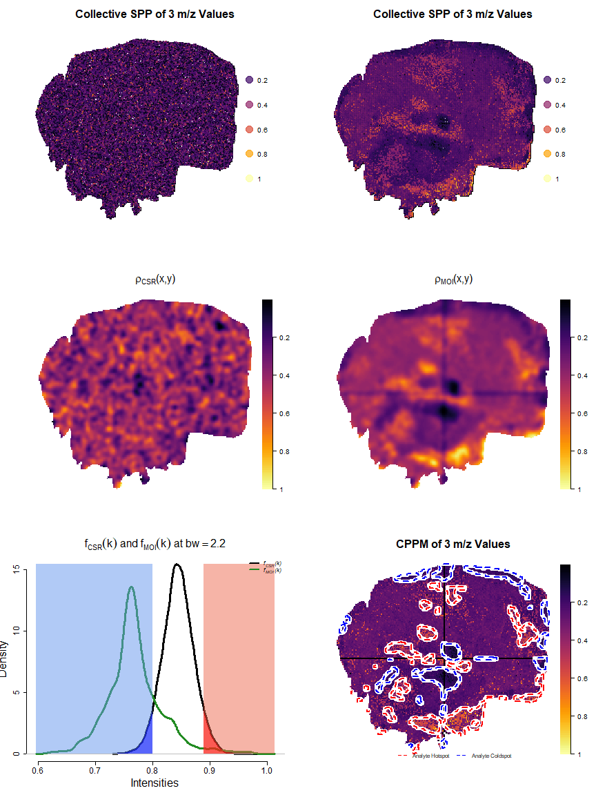

Note that for CPPMs it is recommended to use square root transformation `sqrtTansform=TRUE` for the intensities to limit the impact of unequal ionization effeciency across analytes. It is also advisable to use `bwMethod="scott"` for computational effeciency. 

## CPPMs - Ion Milieus

Same as with lipid class maps, one could create representations of a custom set of analytes. Suppose that ion milieus distribution of all (lyso)glycerophospholipids '(lyso)GPLs' which are the mian constituent of biological membraes. One could first subset `lipidHits` to include PA, PS, PE, PC, PI, PG, LPA, LPS, LPE, LPC, LPI, and LPG:


```r
# create a subset representing lysoGPLs
ofInterest <- c("LPA(x:x)", "LPC(x:x)", "LPE(x:x)", "LPG(x:x)","LPI(x:x)", "LPS(x:x)", 
                "PA(x:x)", "PC(x:x)", "PE(x:x)","PG(x:x)", "PI(x:x)", "PS(x:x)")

# subset lipidHits
lysoGPLs <- subsetAnalytes(lipidHits, lipidClass %in% ofInterest)

lysoGPLs
#> Marked planar point pattern: 5810050 points
#> Mark variables: idx, intensity 
#> window: polygonal boundary
#> enclosing rectangle: [108.45, 305.55] x [139.45, 314.55] units

# detected classes
cat("detected lipid classes: \n")
#> detected lipid classes:
unique(lysoGPLs$metaData$lipidClass)
#> [1] "LPA(x:x)" "LPC(x:x)" "LPE(x:x)" "LPS(x:x)" "PA(x:x)"  "PC(x:x)"  "PE(x:x)"  "PG(x:x)"  "PS(x:x)"
```


Then one could further use `subsetAnalytes` to subset `lysoGPLs` according to any analyte characterestic of the `metaData` table i.e. 


```r
# meta data table columns
colnames(lysoGPLs$metaData)
#>  [1] "idx"            "mzVals"         "mzConfirmed"    "mode"           "adduct"         "lipidID"        "sumformula"     "abbrev"         "numDoubleBonds"
#> [10] "lipidClass"
```
To this end, one could visualize for example all [M+K]+ adducts of detected (lyso)GPLs: 


```r
# detected adducts
cat("detected adducts: ")
#> detected adducts:
table(lysoGPLs$metaData$adduct)
#> 
#>  M+H  M+K M+Na 
#>  135   26   99


# subsetting
kHits           <- subsetAnalytes(lysoGPLs, adduct == "M+K")
# or NHits      <- subsetAnalytes(lysoGPLs, adduct == "M+Na")
# or HHits      <- subsetAnalytes(lysoGPLs, adduct == "M+H")
```

To apply CPPMs and plot the result for [M+K]+:


```r

# compute CPPM
probImg    = probMap(kHits, bwMethod = "scott", sqrtTansform = TRUE)

if(probImg$sppMoi$n > 50000) {
  cat("plotting ", format(probImg$sppMoi$n, big.mark = ","), " points - this takes time! \n")
}
par(cex.lab = 2, cex.main = 2, cex.axis = 1.5)

plot(probImg, what = "detailed", analyte = paste0("[M+k]+ of (lyso)GPLs - n=", length(probImg$sppMoi$metaData$mzVals)))

```

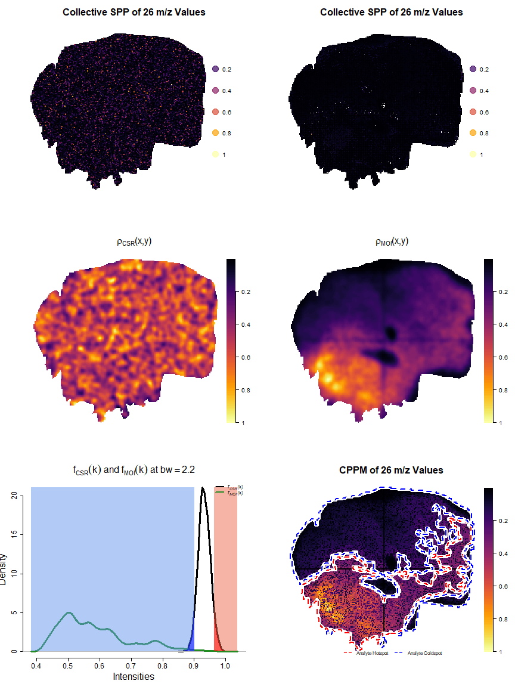


## CPPMs - Lipid Saturation

The same technique could applied to investigate lyso(GPLs) saturation (saturated, mono-unsaturated, di-unsaturated and poly-unsaturated) within one image space by subsetting based on the number of double-bonds of the lipid fatty acid chain. 


```r
detectedSaturation <- c("sat", "mono-unsat", "di-unsat", "poly-unsat")


# subsetting
satHits             <- subsetAnalytes(lysoGPLs, numDoubleBonds == 0)
# or monoHits       <- subsetAnalytes(lysoGPLs, numDoubleBonds == 1)
# or diHits         <- subsetAnalytes(lysoGPLs, numDoubleBonds == 2)
# or polyHits       <- subsetAnalytes(lysoGPLs, numDoubleBonds > 2)
```

input for the specific saturation


```r
# compute CPPM
probImg    = probMap(satHits, bwMethod = "scott", sqrtTansform = TRUE)
#> Attempting to generate 1413633 random points

if(probImg$sppMoi$n > 50000) {
  cat("plotting ", format(probImg$sppMoi$n, big.mark = ","), " points - this takes time! \n")
}
par(cex.lab = 2, cex.main = 2, cex.axis = 1.5)
plot(probImg, what = "detailed", analyte = paste0("mono-unsat of ", "(lyso)GPLs", " - n=", length(probImg$sppMoi$metaData$mzVals)))
```

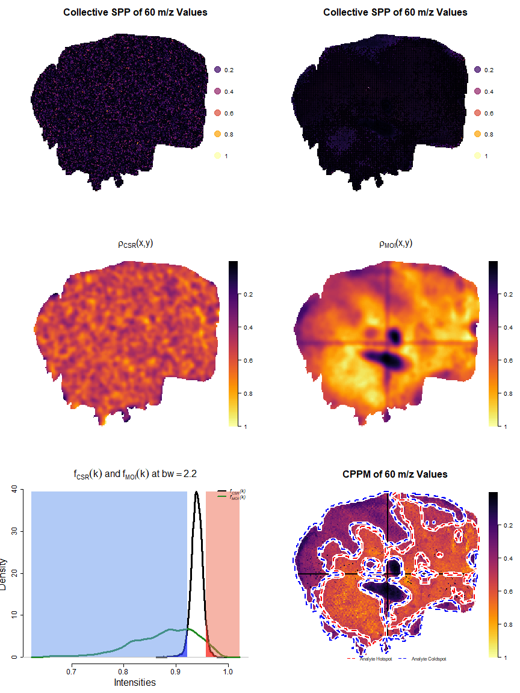

# Session Information


```r
sessionInfo()
#> R version 4.0.2 (2020-06-22)
#> Platform: x86_64-w64-mingw32/x64 (64-bit)
#> Running under: Windows 10 x64 (build 19041)
#> 
#> Matrix products: default
#> 
#> locale:
#> [1] LC_COLLATE=English_Germany.65001  LC_CTYPE=English_Germany.1252     LC_MONETARY=English_Germany.65001 LC_NUMERIC=C                     
#> [5] LC_TIME=English_Germany.65001    
#> system code page: 65001
#> 
#> attached base packages:
#> [1] stats     graphics  grDevices datasets  utils     methods   base     
#> 
#> other attached packages:
#> [1] moleculaR_0.8.5
#> 
#> loaded via a namespace (and not attached):
#>  [1] terra_1.4-11          xfun_0.28             splines_4.0.2         lattice_0.20-45       colorspace_2.0-2      spatstat.utils_2.2-0  vctrs_0.3.8          
#>  [8] htmltools_0.5.2       viridisLite_0.4.0     yaml_2.2.1            mgcv_1.8-38           utf8_1.2.2            rlang_0.4.12          spatstat.data_2.1-0  
#> [15] pillar_1.6.4          glue_1.5.0            sp_1.4-5              lifecycle_1.0.1       stringr_1.4.0         spatstat.core_2.3-0   munsell_0.5.0        
#> [22] gtable_0.3.0          raster_3.5-2          codetools_0.2-16      evaluate_0.14         knitr_1.36            fastmap_1.1.0         parallel_4.0.2       
#> [29] fansi_0.5.0           highr_0.9             Rcpp_1.0.7            tensor_1.5            renv_0.13.0           scales_1.1.1          abind_1.4-5          
#> [36] deldir_1.0-6          gridExtra_2.3         ggplot2_3.3.5         digest_0.6.28         stringi_1.7.5         spatstat.sparse_2.0-0 polyclip_1.10-0      
#> [43] grid_4.0.2            tools_4.0.2           magrittr_2.0.1        goftest_1.2-3         tibble_3.1.6          crayon_1.4.2          pkgconfig_2.0.3      
#> [50] ellipsis_0.3.2        Matrix_1.3-4          rmarkdown_2.11        viridis_0.6.2         R6_2.5.1              MALDIquant_1.20       rpart_4.1-15         
#> [57] spatstat.geom_2.3-0   nlme_3.1-153          compiler_4.0.2
```
# _moleculaR_ Shiny Apps 

_moleculaR_ provides two R Shiny web apps with intuitive web-based GUIs; a `example-app` which comes pre-loaded with an examplary reduced MALDI MSI dataset (for more info refer to this (preprint)[https://doi.org/10.1101/2021.10.27.466114]) and is used for demonstration purposes only and a `package-app` which lets the user upload her own centroided [imzML](https://ms-imaging.org/imzml/) data and apply spatial probability mapping through Molecular Probability Maps (MPMs) and Collective Projection Probability Maps (CPPMs). 

## Loading Data

This step only applies to `package-app`. The first step using the shiny `package-app`, would be to upload you own data. To do this click on `imzML & ibd` File and navigate to the directory containing the files you want to upload. Then select both imzML- and ibd-Files and upload them. Via `Spectrum .tsv File` uPload a continuous spectrum in `tsv` format which would represent either a single random pixel or a mean spectrum of your imaging dataset. Finally, upload the METASPACE annotation results (optional) via `Metaspace.csv File` which should be in a `csv` format. 

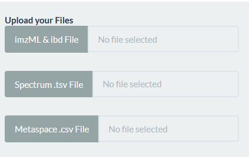

After successfully loading the data the message "Upload complete" should appear.

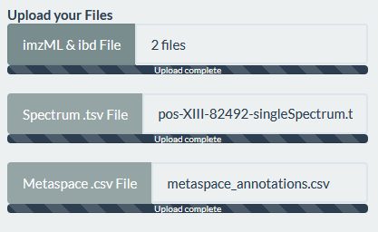

When all files are fully loaded you can proceed and use the Peaks FWHM Estimation. To do this press `Initialize` as shown in the figure below.


A progress bar will appear at the bottom right of the app.


When the data has been processed and FWHM has been estimated, a plot will appear showing the approximation.

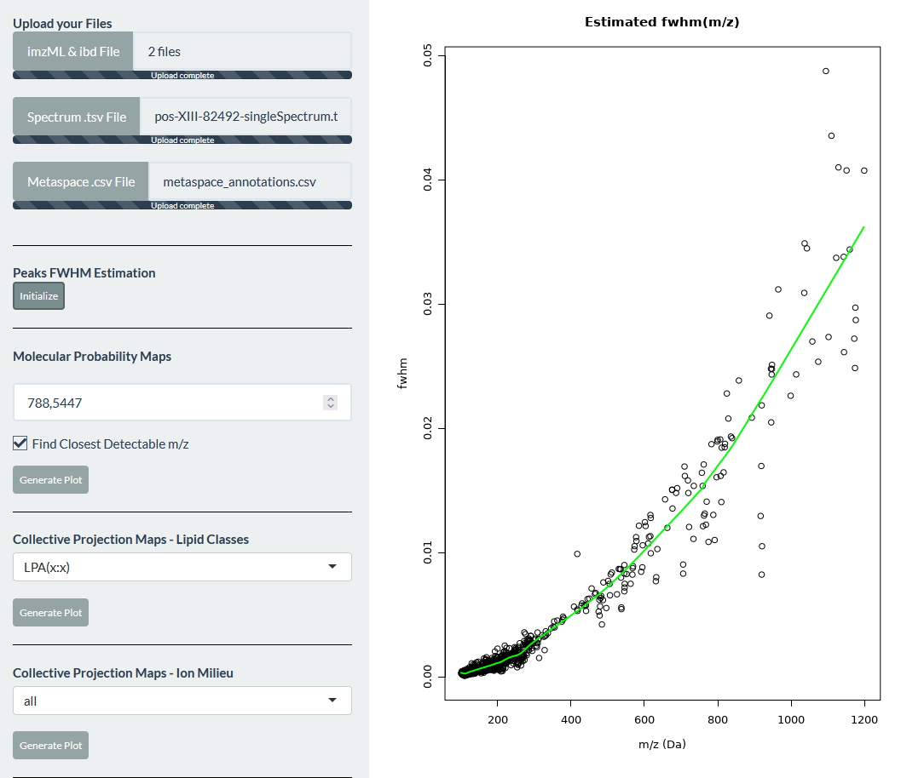{width=70%}


## MPMs

To compute molecular probability maps (MPM), one could enter an exact mass. By default the closest m/z-value found in the dataset will be chosen. If you are looking for an exact mass, deactivate the checkbox shown in the figure below.


After entering the desired mass press `Generate Plot` and wait until the plots are generated. 

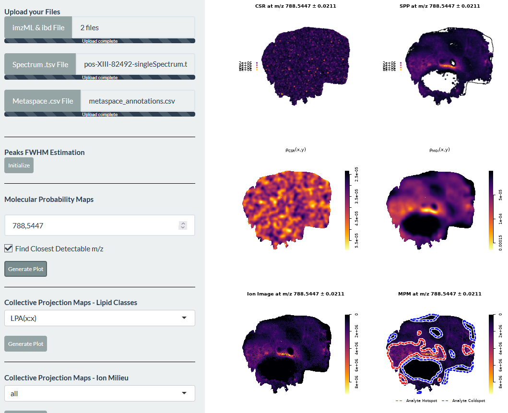{width=70%}


## CPPMs

Currently three different Collective Projection probability Maps (CPPMs) are supported; `Lipid Classes`, `Ion Milieus` and `Lipid Saturation`.

### Lipid Classes

To generate CPPMs of specific lipid classes one can choose a lipid from the drop-down menu before pressing "Generate Plot". 


After the generation is completed,  plot similar to the one below is displayed.

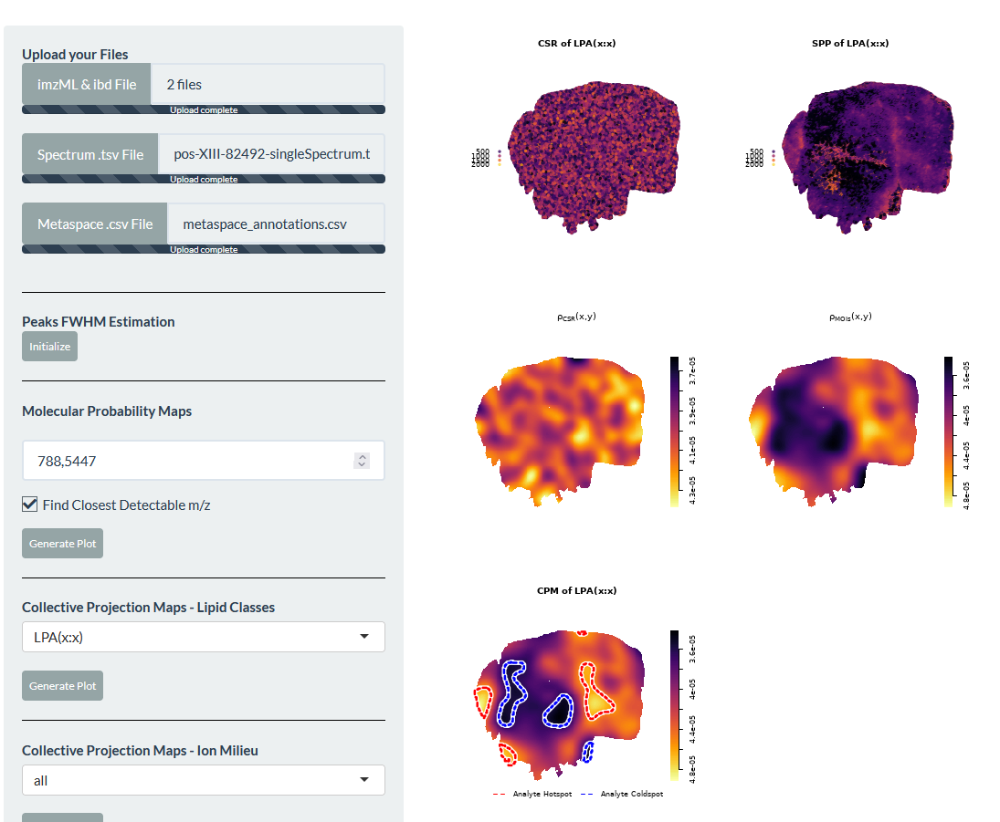{width=70%}


### Ion Milieus

For Ion Milleu generation one can choose between ```all, M+K, M+Na and M+H``` from the drop-down menu before pressing "Generate Plot". 


After the generation is completed,  plot similar to the one below is displayed.

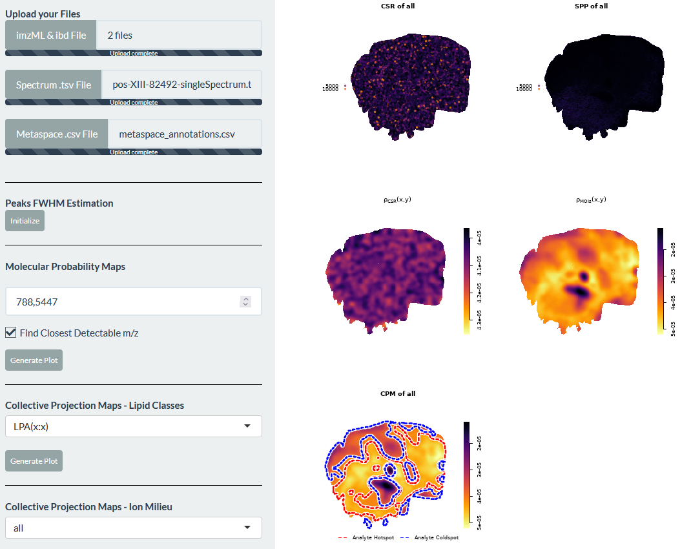{width=70%}


### Lipid Saturation

For Lipid Saturation generation one can choose between ```all, sat., mono., di. and poly.``` from the dropdown menu before pressing "Generate Plot". 


After the generation is completed,  plot similar to the one below is displayed.

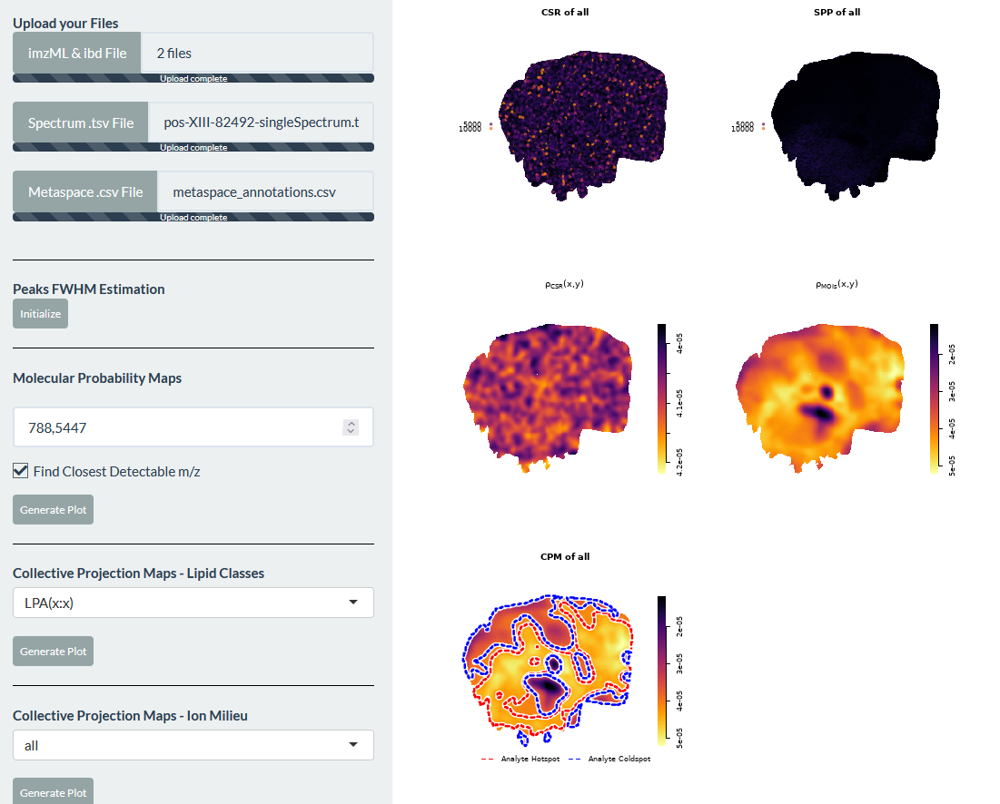{width=70%}


